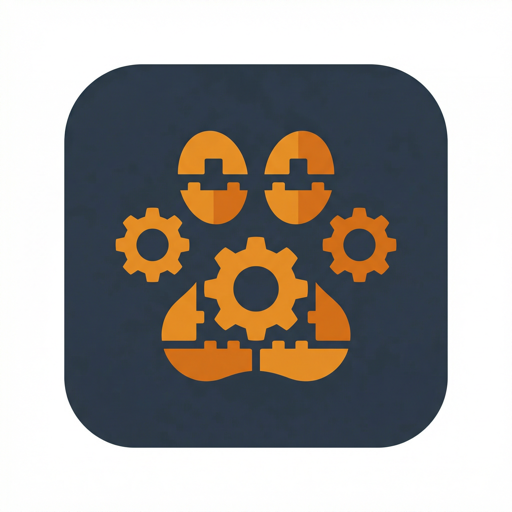
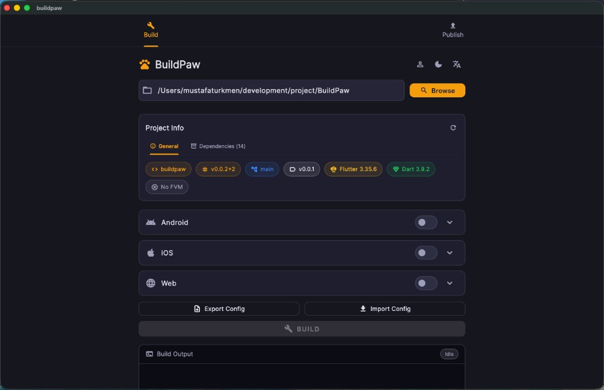
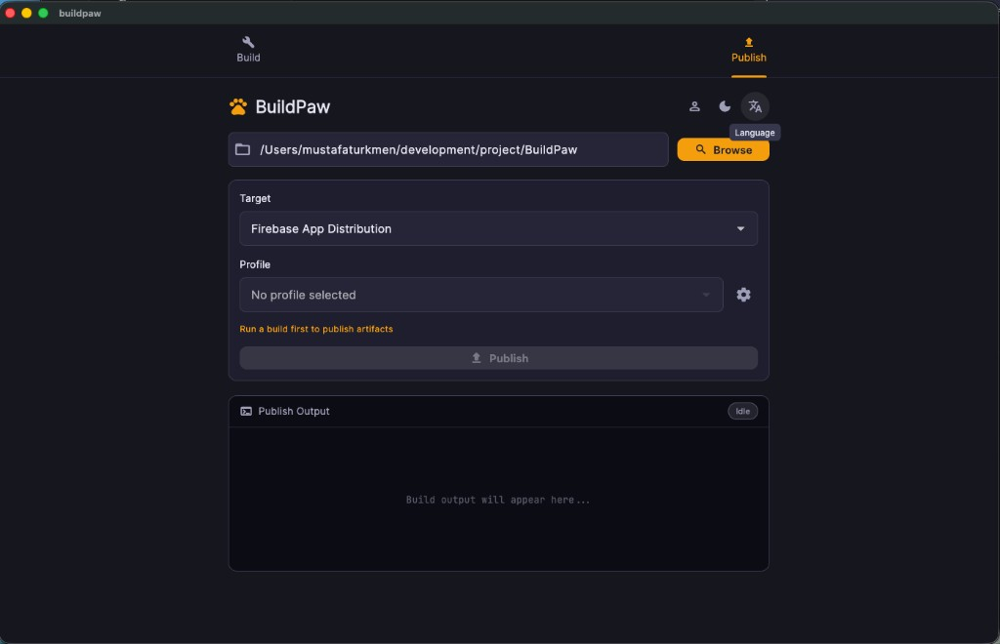
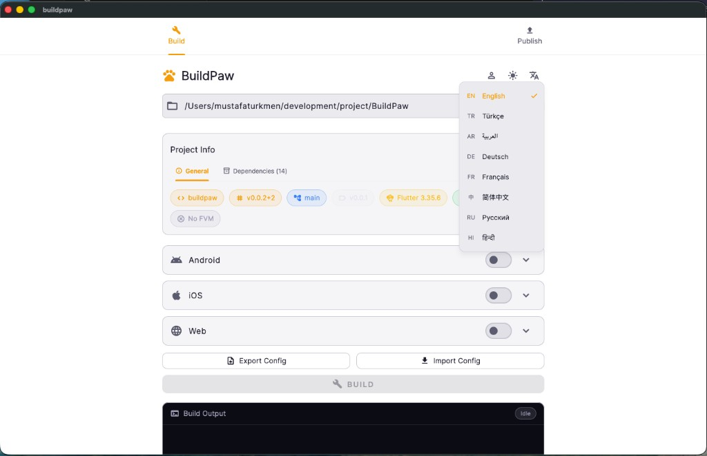
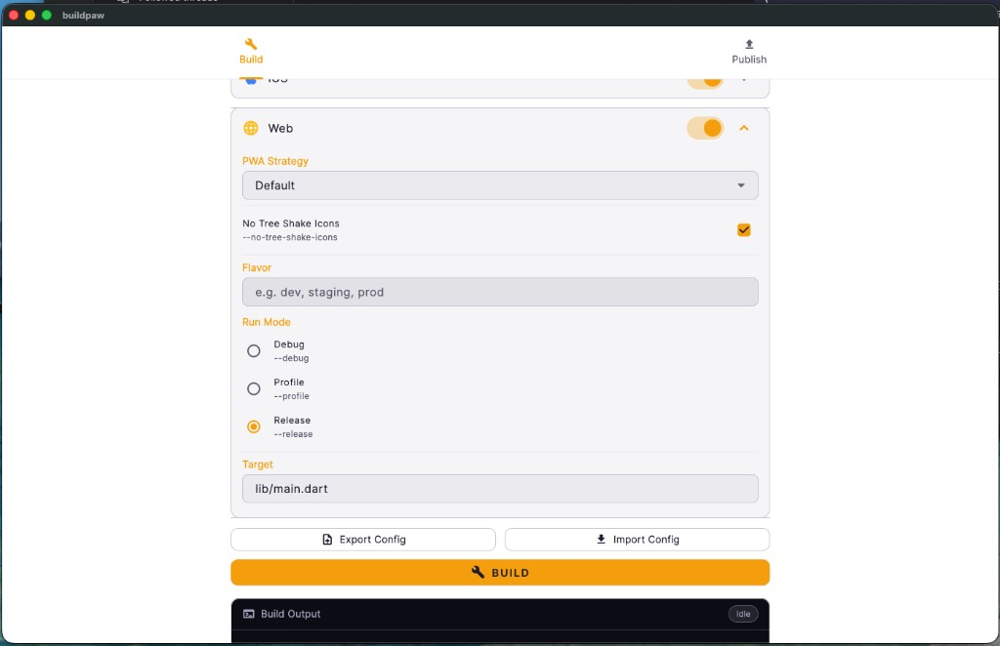
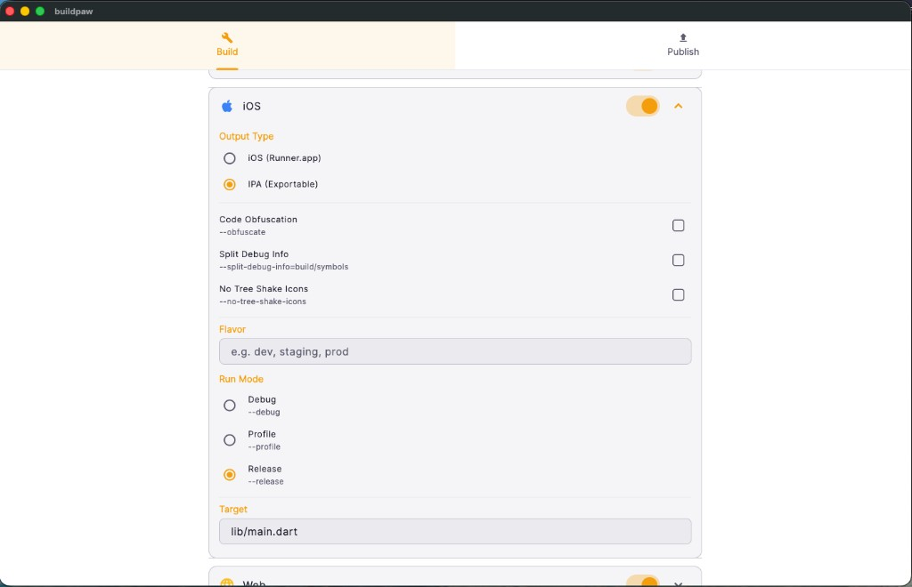
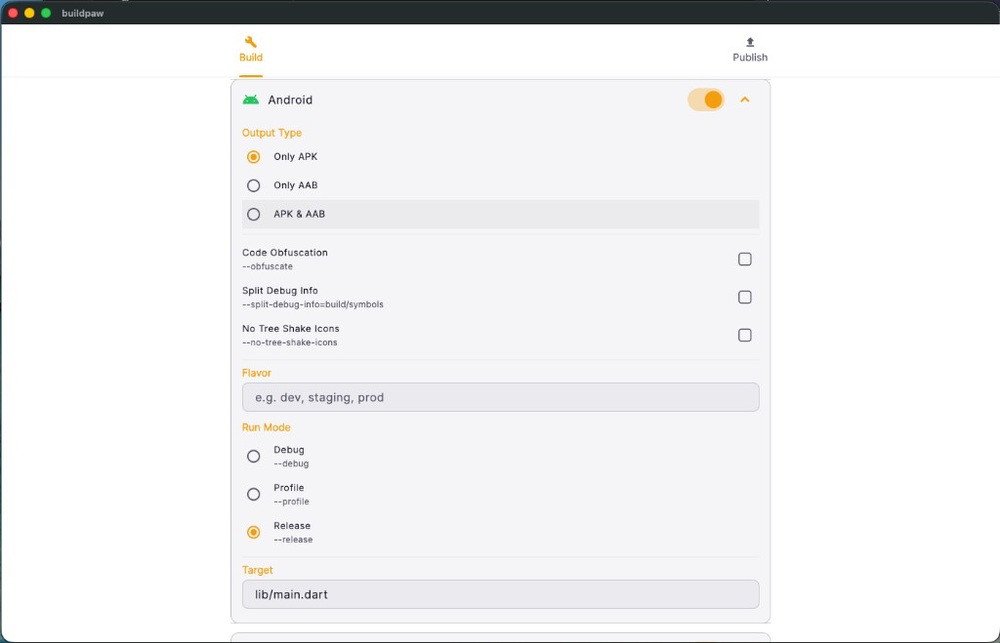

<p align="center">
  
</p>

<h1 align="center">BuildPaw</h1>

<p align="center">
  <strong>A beautiful Flutter Desktop app to manage build processes without the CLI complexity.</strong>
</p>

<p align="center">
  
  
  
  
  
</p>

---

## What is BuildPaw?

BuildPaw is a **Flutter Desktop GUI application** (macOS first-class citizen) that replaces the mental overhead of remembering and typing complex `flutter build` CLI commands. Select your project, toggle platforms, configure options, and hit **BUILD** — all from a clean, modern interface.

### Key Highlights

- **Multi-platform builds** — Android (APK/AAB), iOS (Runner/IPA), Web — all in one place
- **Real-time log streaming** — Terminal-style output with color-coded messages
- **FVM aware** — Auto-detects `.fvm` and prefixes commands accordingly
- **Config profiles** — Save, load, and switch between build configurations instantly
- **Export/Import presets** — Share build configs as versioned JSON files (Postman-style)
- **Drag & Drop import** — Drop a JSON config file onto the app to load it
- **Artifact management** — Collects build outputs to a timestamped folder on Desktop
- **8 languages** — EN, TR, AR, DE, FR, ZH (Simplified), RU, HI with full RTL support

---

## Screenshots

<p align="center">
  
  
  
</p>
<p align="center">
  
  
  
</p>

*Material 3 dark/light theme with an amber/orange "paw" color palette. 8 languages supported.*

---

## Architecture

BuildPaw follows **Clean Architecture** with a clear separation of concerns:

```
lib/
├── core/                    # Theme, colors, constants, i18n
├── domain/                  # Enums, models (pure Dart, no dependencies)
├── application/             # Cubits, Blocs, services (business logic)
├── infrastructure/          # Process execution, Git, Flutter CLI, file system
└── presentation/            # Pages, widgets (UI layer)
```

| Layer | Responsibility |
|---|---|
| **Domain** | `BuildPreset`, `ProjectInfo`, `AndroidBuildConfig`, enums |
| **Application** | `ProjectCubit`, `BuildConfigCubit`, `BuildExecutionBloc`, `ProfileCubit` |
| **Infrastructure** | `ProcessService`, `GitService`, `FlutterService`, `FileSystemService` |
| **Presentation** | `HomePage`, config panels, log panel, profile/theme/language selectors |

**State Management:** Bloc / Cubit (`flutter_bloc`)

---

## Getting Started

### Prerequisites

- Flutter SDK `>=3.35.6`
- Dart SDK `>=3.9.2`
- macOS (primary target)

### Installation

```bash
# Clone the repository
git clone https://github.com/your-username/BuildPaw.git
cd BuildPaw

# Install dependencies
flutter pub get

# Generate i18n translations
dart run slang

# Run the app
flutter run -d macos
```

### macOS Entitlements

The app requires the following entitlements (already configured):

- App Sandbox **disabled** — needed for `Process.start()` and file system access
- File read/write permission
- Network client permission (for `google_fonts`)

---

## Features

### Project Selection & Info

Select any Flutter project directory. BuildPaw automatically detects:

| Info | Source |
|---|---|
| Project name | `pubspec.yaml` → `name` |
| Version | `pubspec.yaml` → `version` |
| Branch | `git branch --show-current` |
| Latest tag | `git describe --tags --abbrev=0` |
| Flutter version | `flutter --version --machine` |
| Dart version | `dart --version` |
| FVM status | `.fvm/` directory check |
| Dependencies | `pubspec.lock` (resolved) or `pubspec.yaml` (constraints) |

### Platform Configuration

| Android | iOS | Web |
|---|---|---|
| APK / AAB / Both | Runner.app / IPA | PWA strategy |
| Code obfuscation | Code obfuscation | No tree shake icons |
| Split debug info | Split debug info | — |
| Flavor | Flavor | Flavor |
| Build mode | Build mode | Build mode |
| Target file | Target file | Target file |

### Build Profiles

Save your build configurations as named profiles stored persistently via `SharedPreferences`. Switch between profiles with a single click from the header menu.

### Config Export/Import

Export configurations as versioned JSON presets (Postman-collection style):

```json
{
  "info": {
    "name": "release-prod",
    "version": "1.0.0",
    "exportedAt": "2026-02-26T14:30:00Z",
    "buildPawVersion": "1.0.0"
  },
  "platforms": { "android": true, "ios": false, "web": true },
  "android": { ... },
  "web": { ... }
}
```

Import via file picker or **drag & drop** a JSON file directly onto the app.

### Internationalization

| Language | Code | Direction |
|---|---|---|
| English | `en` | LTR |
| Turkce | `tr` | LTR |
| العربية | `ar` | **RTL** |
| Deutsch | `de` | LTR |
| Francais | `fr` | LTR |
| 简体中文 | `zh` | LTR |
| Русский | `ru` | LTR |
| हिन्दी | `hi` | LTR |

Technical content (terminal output, file paths, package names, CLI flags) remains LTR regardless of the selected language.

---

## Tech Stack

| Technology | Usage |
|---|---|
| [Flutter](https://flutter.dev) | UI framework (Material 3) |
| [flutter_bloc](https://pub.dev/packages/flutter_bloc) | State management |
| [equatable](https://pub.dev/packages/equatable) | Value equality |
| [file_picker](https://pub.dev/packages/file_picker) | Directory/file selection |
| [google_fonts](https://pub.dev/packages/google_fonts) | JetBrains Mono for terminal |
| [shared_preferences](https://pub.dev/packages/shared_preferences) | Persistent profile storage |
| [slang](https://pub.dev/packages/slang) | Type-safe i18n |
| [desktop_drop](https://pub.dev/packages/desktop_drop) | Drag & drop file import |
| [very_good_analysis](https://pub.dev/packages/very_good_analysis) | Lint rules |

---

## Project Structure

```
BuildPaw/
├── lib/
│   ├── main.dart                          # Entry point
│   ├── app.dart                           # MultiBlocProvider + MaterialApp
│   ├── core/
│   │   ├── theme/                         # AppTheme (dark/light), AppColors
│   │   ├── constants/                     # AppConstants
│   │   └── i18n/                          # 8 locale JSON files + generated code
│   ├── domain/
│   │   ├── enums/                         # BuildMode, BuildPlatform, OutputTypes
│   │   └── models/                        # ProjectInfo, BuildConfigs, BuildPreset
│   ├── application/
│   │   ├── project/                       # ProjectCubit (select + load info)
│   │   ├── build_config/                  # BuildConfigCubit (platform toggles + config)
│   │   ├── build_execution/               # BuildExecutionBloc (run + stream logs)
│   │   ├── profile/                       # ProfileCubit (save/load/apply profiles)
│   │   ├── theme/                         # ThemeCubit (dark/light toggle)
│   │   ├── locale/                        # LocaleCubit (language persistence)
│   │   └── services/                      # BuildCommandGenerator, ArtifactManager
│   ├── infrastructure/
│   │   └── services/                      # Process, Git, Flutter, FileSystem, ProfileStorage
│   └── presentation/
│       ├── pages/                         # HomePage
│       └── widgets/                       # All UI components
├── macos/                                 # macOS runner + entitlements
├── slang.yaml                             # i18n configuration
├── analysis_options.yaml                  # very_good_analysis
└── pubspec.yaml
```

---

## Contributing

1. Fork the repository
2. Create your feature branch (`git checkout -b feature/amazing-feature`)
3. Commit your changes following the convention: `feat(#1234): add amazing feature`
4. Push to the branch (`git push origin feature/amazing-feature`)
5. Open a Pull Request

### Commit Convention

```
<type>(#taskId): <description>

Types: feat, fix, docs, style, refactor, perf, test, build, revert, hotfix
```

---

## License

This project is licensed under the GNU GPL v3 (Copyleft). See [LICENSE](LICENSE) for details.

---

<p align="center">
  Built with Flutter & lots of paw prints
</p>
